Blood_Immune_ScRNAseq_Trajectory_Analysis
================

## Objectives

### Single-cell Transcriptomic Landscape of Human Blood Cells using data from the journal article “Single-cell transcriptomic landscape of human blood cells”

### Xie et al., 2021, Natl Sci Rev 8:nwaa180.

### The authors profiled the transcriptomes of 7,643 human blood cells covering 32 immunophenotypic cell types across 21 healthy donors. They have constructed the single-cell transcriptional atlas of blood cells on the basis of protein-coding genes and long noncoding RNAs (lncRNAs) respectively, and showed a high consistence between them. Notably, lncRNAs and novel transcription factors regulating hematopoietic cell differentiation were identified.

### Single cell RNAseq for BM/PB-derived 32 blood cells

### GEO with the following accession code: GSE137864 and GSE149938

## Data

### Raw data is accessible from <http://scrna.sklehabc.com/>

## Setup

``` r
pacman::p_load(tidyverse, 
               monocle3,Seurat, 
               SeuratWrappers,
               ggplot2)

rm(list=ls())
```

## Read in data

``` r
# read in data
markers <- read.delim('./data/ABC_Marker.txt', header = T) # gene metadata
metadata <- read.delim('./data/ABC_Meta.txt', header = T) # cell metadata
expr <- read.delim('./data/ABC_umi_matrix_7551_cells.csv', header = T, sep = ',') # expression matrix
```

## Understanding the data

``` r
#Inspect that data
dim(expr)

#taking a peek at different parts of the gene expression matrix
expr[1:5,1:5]
expr[100:105,100:105]

#to show that the data is not blank
max(expr)
min(expr)
```

``` r
#Inspect that data
dim(metadata)

#taking a peek at different parts of the gene expression matrix
metadata
```

``` r
#Inspect that data
dim(markers)

#taking a peek at different parts of the gene expression matrix
markers
```

## Create Seurat Object

``` r
expr.t <- t(expr)
seu.obj <- CreateSeuratObject(counts = expr.t)
```

    ## Warning: Data is of class matrix. Coercing to dgCMatrix.

## Merge data

``` r
seu.obj@meta.data <- merge(seu.obj@meta.data, metadata, by.x = 'row.names', by.y = 'cell_id')

seu.obj@meta.data 
```

## Convert column data to row

``` r
seu.obj@meta.data <- seu.obj@meta.data %>% 
  column_to_rownames(var = 'Row.names')

seu.obj@meta.data 
```

## Calculate % mitochondria (dying cells)

``` r
seu.obj@meta.data[["mitopercent"]] <- PercentageFeatureSet(seu.obj, pattern = "^MT-")
seu.obj.filtered <- subset(seu.obj, subset = nCount_RNA > 800 &
                    nFeature_RNA > 500 &
                    mitopercent < 10)
```

## subset the seurat object - T cells

``` r
unique(seu.obj.filtered@meta.data$population)
```

    ## [1] "sp" "t"  "mo" "nk" "e"  "b"  "n"

``` r
Idents(seu.obj.filtered) <- seu.obj.filtered$population
t.seu <- subset(seu.obj.filtered, idents = "t")
t.seu
```

    ## An object of class Seurat 
    ## 19813 features across 517 samples within 1 assay 
    ## Active assay: RNA (19813 features, 0 variable features)
    ##  1 layer present: counts

``` r
unique(t.seu@meta.data$redefined_cluster)
```

    ## [1] "CD4 memory T"   "CD4 naive T"    "CD4 effector T" "CD8 effector T"
    ## [5] "CD8 naive T"    "CD8 memory T"

## Data Preprocessing using Seurat Object

``` r
t.seu <- NormalizeData(t.seu)
```

    ## Normalizing layer: counts

``` r
t.seu <- FindVariableFeatures(t.seu)
```

    ## Finding variable features for layer counts

``` r
t.seu <- ScaleData(t.seu)
```

    ## Centering and scaling data matrix

``` r
t.seu <- RunPCA(t.seu)
```

    ## PC_ 1 
    ## Positive:  RPL31, RPL10, CCR7, SELL, RPL36, MAL, LTB, IL7R, NFKBIA, NOSIP 
    ##     RPS8, TCF7, BIRC3, TXK, JUNB, EPHX2, SERINC5, OXNAD1, C1orf162, TMIGD2 
    ##     NGFRAP1, TCEA3, FHIT, AIF1, BEX2, GPR183, GPX4, HAPLN3, FBL, RIC3 
    ## Negative:  NKG7, CCL5, CST7, GZMH, GZMA, PRF1, FGFBP2, PLEK, GZMB, CCL4 
    ##     MYO1F, KLRD1, HLA.DPB1, CTSW, ADGRG1, HLA.DPA1, CD99, HOPX, S100A4, S1PR5 
    ##     ZEB2, CLIC1, KLRG1, LGALS1, CD74, SLAMF7, APOBEC3C, APOBEC3G, PRSS23, GNLY 
    ## PC_ 2 
    ## Positive:  GZMH, FGFBP2, VGLL4, PRF1, CX3CR1, ADGRG1, S1PR5, MIEN1, SPON2, GZMB 
    ##     RGS2, PRSS23, PROK2, CD99, HLA.DPB1, SLCO4C1, UCP2, CD52, DDX28, COX14 
    ##     COMT, IL18RAP, KLRG1, RHEBL1, ZNF365, ITGB1, C9orf142, ZNF683, TMEM70, JAZF1 
    ## Negative:  IL1RN, KIF14, ITGAD, KIR2DL4, TOP2A, KIF4A, MAL2, HBA2, LYN, HIST1H2BD 
    ##     CCL3, CDKN2A, KIAA0101, SMARCA1, NCAPG2, ABCC6, ZNF827, BARX2, CLVS2, C15orf39 
    ##     SH3BGR, OXT, ZNF649, RAD51AP1, AURKB, HOXB4, PPP1R3D, HBB, S100A9, SLC4A8 
    ## PC_ 3 
    ## Positive:  SENP3, SLC4A8, FGFBP2, PRSS23, FBXO5, ADGRG1, GZMB, CCDC102B, BCDIN3D, STK40 
    ##     DDX51, S1PR5, MTHFR, ZMYND10, MSANTD4, CDC34, PUS1, SPON2, ZNF747, FCGR3A 
    ##     AIF1, GZMH, KIF14, UPP1, RP11.382A20.3, HEATR4, GGPS1, FBF1, STMN1, ERCC5 
    ## Negative:  RGS1, ATP6V0A1, DUSP1, ZFP36, NR4A2, EPHA4, JUNB, FOSB, FOS, CACNG8 
    ##     C1orf61, SPATA7, ZNF358, STAT1, STK16, DUSP2, TMEM101, MBD2, CXCR3, ADAT1 
    ##     PLAUR, E2F2, HBA1, CDADC1, ZNF331, PARP6, PDDC1, RIC1, EID2B, JUN 
    ## PC_ 4 
    ## Positive:  RIC1, AGPS, ITGB1, NLK, SOCS2, SEC63, E2F2, BLM, SPATA7, XKR6 
    ##     CCDC17, MYOM2, CACNG8, DAZAP1, AIRE, CAPG, ZNF358, MADD, MBD2, LAMB1 
    ##     GNLY, HECTD3, MAST4, HEATR4, EPHA4, CXorf57, ZMYND10, CD52, RECQL5, TRAPPC8 
    ## Negative:  CD8B, CD8A, DUSP2, CCL3L3, RGS1, CMC1, LYST, JUNB, NR4A2, REL 
    ##     MAL2, HLA.DPA1, ZFP36, TCEAL3, PLPP5, ITGAD, ZNF331, JUN, CPT1C, TOP2A 
    ##     DUSP1, KIF4A, ENC1, ZNF827, NME1, CD74, SLC25A4, HLA.DRA, PIGP, LACTB2 
    ## PC_ 5 
    ## Positive:  STRBP, HEATR3, ELF3, LRRC16A, HYDIN, DFNB31, CPEB3, ADAMTS6, ARMC9, TMEM244 
    ##     CLU, L3MBTL4, XKR4, RGS8, KDM4B, CFD, ARHGEF37, IQCF3, ZNF155, ZNF763 
    ##     EPHA4, CPT1C, LRRC7, TCEAL3, PRKG1, SIAE, RASGRF2, MORC4, ACOX1, PAAF1 
    ## Negative:  HBA2, CD79B, TACO1, ACTB, CRIP2, SNX16, NPDC1, PLEKHA2, LTB, ITGB1 
    ##     CHID1, NCAPG2, HIST1H2BD, SFMBT1, CD52, HBB, SCN1B, KIF16B, CLIC1, MYOM2 
    ##     GM2A, FOS, NCALD, GLB1, NDUFV3, IL32, M6PR, KIF14, FAM50A, RAD51AP1

``` r
t.seu <- FindNeighbors(t.seu, dims = 1:30)
```

    ## Computing nearest neighbor graph

    ## Computing SNN

``` r
t.seu <- FindClusters(t.seu, resolution = 0.9)
```

    ## Modularity Optimizer version 1.3.0 by Ludo Waltman and Nees Jan van Eck
    ## 
    ## Number of nodes: 517
    ## Number of edges: 35270
    ## 
    ## Running Louvain algorithm...
    ## Maximum modularity in 10 random starts: 0.5205
    ## Number of communities: 3
    ## Elapsed time: 0 seconds

``` r
t.seu <- RunUMAP(t.seu, dims = 1:30, n.neighbors = 50)
```

    ## Warning: The default method for RunUMAP has changed from calling Python UMAP via reticulate to the R-native UWOT using the cosine metric
    ## To use Python UMAP via reticulate, set umap.method to 'umap-learn' and metric to 'correlation'
    ## This message will be shown once per session

    ## 17:42:20 UMAP embedding parameters a = 0.9922 b = 1.112

    ## Found more than one class "dist" in cache; using the first, from namespace 'BiocGenerics'

    ## Also defined by 'spam'

    ## 17:42:20 Read 517 rows and found 30 numeric columns

    ## 17:42:20 Using Annoy for neighbor search, n_neighbors = 50

    ## Found more than one class "dist" in cache; using the first, from namespace 'BiocGenerics'

    ## Also defined by 'spam'

    ## 17:42:20 Building Annoy index with metric = cosine, n_trees = 50

    ## 0%   10   20   30   40   50   60   70   80   90   100%

    ## [----|----|----|----|----|----|----|----|----|----|

    ## **************************************************|
    ## 17:42:20 Writing NN index file to temp file C:\Users\Vincent\AppData\Local\Temp\RtmpMJgUEs\file11e8bd931b
    ## 17:42:20 Searching Annoy index using 1 thread, search_k = 5000
    ## 17:42:21 Annoy recall = 100%
    ## 17:42:21 Commencing smooth kNN distance calibration using 1 thread with target n_neighbors = 50
    ## 17:42:22 Initializing from normalized Laplacian + noise (using RSpectra)
    ## 17:42:22 Commencing optimization for 500 epochs, with 33020 positive edges
    ## 17:42:23 Optimization finished

``` r
a1 <- DimPlot(t.seu, reduction = 'umap', group.by = 'redefined_cluster', label = T)
a2 <- DimPlot(t.seu, reduction = 'umap', group.by = 'seurat_clusters', label = T)
a1|a2
```

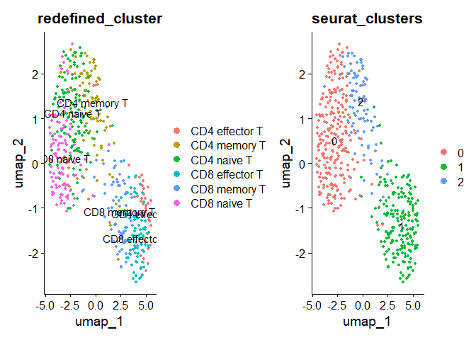

## Monocle3 requires cell_data_set object

### convert seurat object to cell_data_set object for monocle3

``` r
cds <- as.cell_data_set(t.seu)
```

    ## Warning: Monocle 3 trajectories require cluster partitions, which Seurat does
    ## not calculate. Please run 'cluster_cells' on your cell_data_set object

``` r
cds

# to get cell metadata
colData(cds)
# to gene metdata
fData(cds)
rownames(fData(cds))[1:10]

# since it misses the gene_short_name column, let's add it
fData(cds)$gene_short_name <- rownames(fData(cds))

# to get counts
counts(cds)
```

    ##   [[ suppressing 32 column names 'CD4T_tBM_L1_bar26', 'CD4T_tBM_L1_bar27', 'CD4T_tBM_L1_bar30' ... ]]
    ##   [[ suppressing 32 column names 'CD4T_tBM_L1_bar26', 'CD4T_tBM_L1_bar27', 'CD4T_tBM_L1_bar30' ... ]]
    ##   [[ suppressing 32 column names 'CD4T_tBM_L1_bar26', 'CD4T_tBM_L1_bar27', 'CD4T_tBM_L1_bar30' ... ]]

## Cluster cells (using clustering info from seurat’s UMAP)

``` r
# assign paritions
reacreate.partition <- c(rep(1,length(cds@colData@rownames)))
names(reacreate.partition) <- cds@colData@rownames
reacreate.partition <- as.factor(reacreate.partition)


cds@clusters$UMAP$partitions <- reacreate.partition

# Assign the cluster info 

list_cluster <- t.seu@active.ident
cds@clusters$UMAP$clusters <- list_cluster


# Assign UMAP coordinate - cell embeddings

cds@int_colData@listData$reducedDims$UMAP <- t.seu@reductions$umap@cell.embeddings


# plot

cluster.before.trajectory <- plot_cells(cds,
           color_cells_by = 'cluster',
           label_groups_by_cluster = FALSE,
           group_label_size = 5) +
  theme(legend.position = "right")
```

    ## No trajectory to plot. Has learn_graph() been called yet?

``` r
cluster.names <- plot_cells(cds,
           color_cells_by = "redefined_cluster",
           label_groups_by_cluster = FALSE,
           group_label_size = 5) +
  scale_color_manual(values = c('red', 'blue', 'green', 'maroon', 'yellow', 'grey', 'cyan')) +
  theme(legend.position = "right")
```

    ## No trajectory to plot. Has learn_graph() been called yet?

``` r
cluster.before.trajectory | cluster.names
```

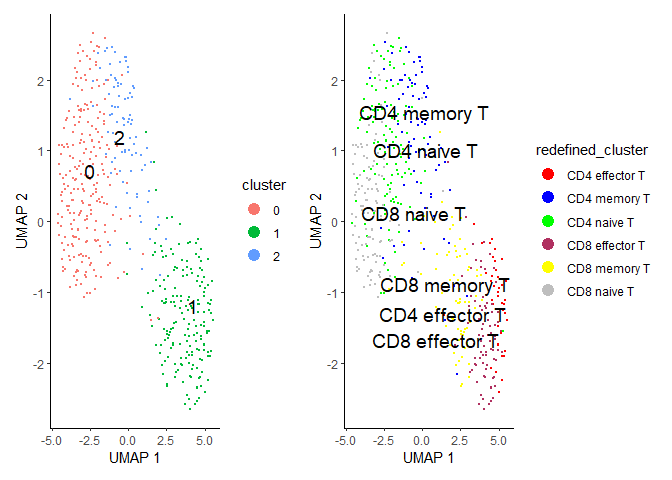

## Learn trajectory graph

``` r
cds <- learn_graph(cds, use_partition = FALSE)
```

    ##   |                                                                              |                                                                      |   0%  |                                                                              |======================================================================| 100%

``` r
plot_cells(cds,
           color_cells_by = 'redefined_cluster',
           label_groups_by_cluster = FALSE,
           label_branch_points = FALSE,
           label_roots = FALSE,
           label_leaves = FALSE,
           group_label_size = 5)
```

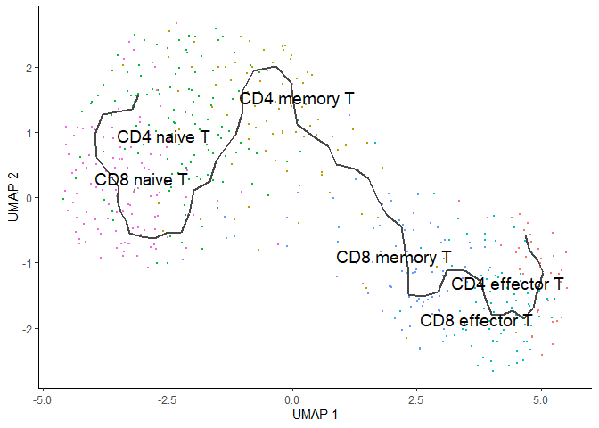

## Order the cells in pseudotime

``` r
cds <- order_cells(cds, reduction_method = 'UMAP', root_cells = colnames(cds[,clusters(cds) == 2]))

plot_cells(cds,
           color_cells_by = 'pseudotime',
           label_groups_by_cluster = FALSE,
           label_branch_points = FALSE,
           label_roots = FALSE,
           label_leaves = FALSE)
```

    ## Cells aren't colored in a way that allows them to be grouped.

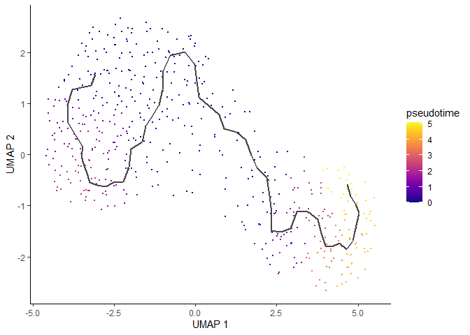

``` r
# cells ordered by monocle3 pseudotime

pseudotime(cds)
```

``` r
cds$monocle3_pseudotime <- pseudotime(cds)
data.pseudo <- as.data.frame(colData(cds))

ggplot(data.pseudo, aes(monocle3_pseudotime, reorder(redefined_cluster, monocle3_pseudotime, median), fill = redefined_cluster)) +
  geom_boxplot()
```


## Finding genes that change as a function of pseudotime

``` r
deg_tcells <- graph_test(cds, neighbor_graph = 'principal_graph', cores = 4)
```

    ## Warning in pbmcapply::pbmclapply(row.names(exprs_mat), FUN = function(x, : mc.cores > 1 is not supported on Windows due to limitation of mc*apply() functions.
    ##   mc.core is set to 1.

``` r
deg_tcells %>% 
  arrange(q_value) %>% 
  filter(status == 'OK') %>% 
  head()
```

    ##      status       p_value morans_test_statistic  morans_I gene_short_name
    ## GZMH     OK  0.000000e+00              44.07540 0.6612061            GZMH
    ## B2M      OK  0.000000e+00              38.86864 0.5861078             B2M
    ## CCL5     OK  0.000000e+00              47.12521 0.7102900            CCL5
    ## NKG7     OK  0.000000e+00              51.16686 0.7703306            NKG7
    ## CST7     OK 9.665329e-278              35.59096 0.5337149            CST7
    ## GZMB     OK 2.281102e-265              34.78194 0.5177707            GZMB
    ##            q_value
    ## GZMH  0.000000e+00
    ## B2M   0.000000e+00
    ## CCL5  0.000000e+00
    ## NKG7  0.000000e+00
    ## CST7 2.774916e-274
    ## GZMB 5.457538e-262

``` r
FeaturePlot(t.seu, features = c('SELL', 'GNLY', 'GZMH'))
```

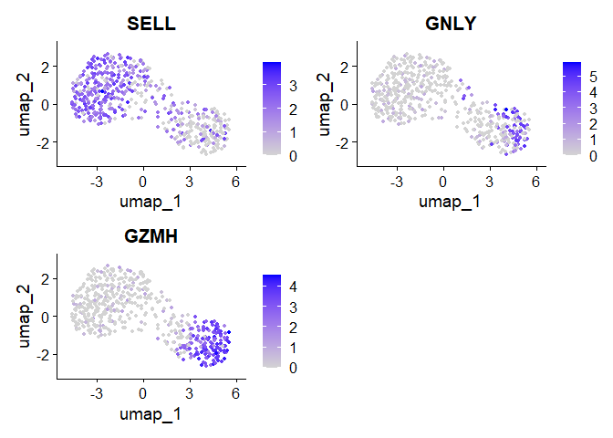

``` r
# visualizing pseudotime in seurat

t.seu$pseudotime <- pseudotime(cds)
Idents(t.seu) <- t.seu$redefined_cluster
FeaturePlot(t.seu, features = "pseudotime", label = T)
```

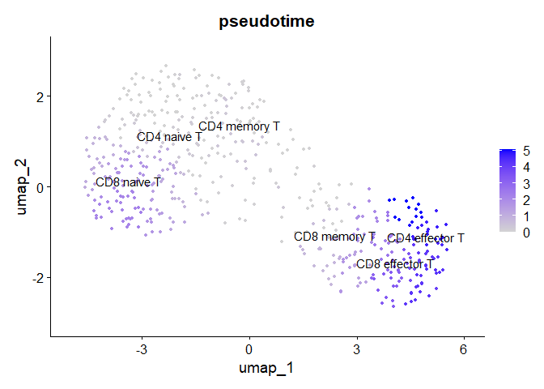

## Subset the Seurat Object - B cells

``` r
b.seu <- subset(seu.obj.filtered, idents = "b")
b.seu
```

    ## An object of class Seurat 
    ## 19813 features across 1448 samples within 1 assay 
    ## Active assay: RNA (19813 features, 0 variable features)
    ##  1 layer present: counts

``` r
unique(b.seu@meta.data$redefined_cluster)
```

    ## [1] "Pre-B/Regulatory B" "Immature B"         "Naive B"           
    ## [4] "Cycling Pre-B"      "Pro-B"              "Memory B"          
    ## [7] "Plasma"

## Data Preprocessing using Seurat Object

``` r
b.seu <- NormalizeData(b.seu)
```

    ## Normalizing layer: counts

``` r
b.seu <- FindVariableFeatures(b.seu)
```

    ## Finding variable features for layer counts

``` r
b.seu <- ScaleData(b.seu)
```

    ## Centering and scaling data matrix

``` r
b.seu <- RunPCA(b.seu)
```

    ## PC_ 1 
    ## Positive:  PTMA, VPREB3, SOX4, STMN1, HMGB2, VPREB1, CD24, NUSAP1, KIAA0101, TOP2A 
    ##     CENPF, MKI67, HBB, DEK, TPX2, TYMS, AURKB, RRM2, BIRC5, H2AFY 
    ##     ZWINT, HJURP, HIST1H2AM, C21orf58, IGLL1, MME, HBA2, HBA1, TCL1A, HIST1H1B 
    ## Negative:  SLAMF7, FKBP11, SDC1, DERL3, TXNDC5, PRDX4, SEC11C, SSR4, SELM, FNDC3B 
    ##     SPAG4, FKBP2, TNFRSF17, ELL2, TRIB1, CD27, PSAP, MEI1, ZBTB38, HDLBP 
    ##     HSP90B1, VIMP, SCNN1B, HERPUD1, PARM1, MYDGF, FAM46C, SSR3, CD63, SEL1L 
    ## PC_ 2 
    ## Positive:  TMEM154, SCIMP, GPR183, HES1, DUSP2, BCL2A1, LY9, CNTNAP2, NFKBIA, TCL1A 
    ##     MACROD2, FCRL3, BTLA, COTL1, ARL4C, SPOCK2, MPEG1, FTL, IER2, SNX10 
    ##     BACE2, RIN3, TSC22D3, IL10RA, PDE4B, CNFN, IL6, DBNDD1, IL2RA, PYHIN1 
    ## Negative:  TYMS, AURKB, NUSAP1, RRM2, TOP2A, CENPF, TPX2, MKI67, UBE2C, KIAA0101 
    ##     GTSE1, BIRC5, HJURP, ZWINT, CKAP2L, CCNB2, KIF15, CDCA8, NUCB2, UBE2T 
    ##     CDKN3, CDCA3, TK1, ESCO2, HMGB2, NCAPG, ASPM, SPC25, DLGAP5, HIST1H1B 
    ## PC_ 3 
    ## Positive:  TMEM154, GPR183, SCIMP, CRIP1, IER2, LY9, TSC22D3, BCL2A1, NFKBIA, HERPUD1 
    ##     HES1, AURKB, DUSP2, SPC25, COTL1, CENPM, KIF15, NCAPG, CDCA8, E2F7 
    ##     UBE2T, CLECL1, RRM2, HJURP, SKA3, CNTNAP2, MCM5, RIC3, PBK, JUN 
    ## Negative:  ARPP21, C10orf10, CD9, DNTT, MME, VPREB1, SMIM3, SOX4, AKAP12, RAG1 
    ##     TOP2B, MYB, IGLL1, REXO2, ERG, SOCS2, SMAD1, HPS4, VPREB3, MT1X 
    ##     RPS4Y2, MZB1, FHIT, HMHB1, GLRX, GNG11, CD99, CMTM8, TNFRSF21, HHIP 
    ## PC_ 4 
    ## Positive:  S100A9, S100A8, S100A12, FCN1, LYZ, CXCL8, MMP9, PTGS2, S100P, LTF 
    ##     G0S2, ANXA1, TYROBP, PLAUR, LCN2, CYP4F3, PLBD1, FYB, MNDA, HBD 
    ##     AHSP, CLEC12A, FCER1G, CAMP, SERPINA1, HBA1, CA1, HBM, GYPB, HBA2 
    ## Negative:  PPIA, PTMA, PRDX1, CD99, MIF, VPREB3, GAPDH, VPREB1, SMIM3, C10orf10 
    ##     FAM26F, COX6C, IGLL1, OST4, KRTCAP2, GLRX, CD9, DNTT, ARPP21, CMTM8 
    ##     HHIP, ADA, ERG, PEBP1, LDHB, HMGN2, HMHB1, EGFL7, HMGB1, SOCS2 
    ## PC_ 5 
    ## Positive:  CD99, GAPDH, ERG, DNTT, S100A4, EGFL7, IFITM3, SOCS2, C5orf56, FAM26F 
    ##     GPR183, TXN, RPS4Y2, S100A6, AIF1, C10orf10, COTL1, PPIA, ADA, HPS4 
    ##     GNG11, NPY, BCL2A1, PLSCR1, CLECL1, COL5A1, TMEM154, ITGB1, CRIP1, HMHB1 
    ## Negative:  TCL1A, PCDH9, ACSM3, IGLL5, CCDC191, BMP3, NSMCE1, HRK, CCDC112, LAMP5 
    ##     TFDP2, GAS7, EMP2, HIST1H1C, DDX54, BEST3, RGS16, STMN1, RAPGEF5, HIST1H2BG 
    ##     DCAF12, CD24, RP1.34B20.21, RIMS3, ROR1, SOX4, RGS2, ZBTB18, TMEM38A, FBXO25

``` r
b.seu <- FindNeighbors(b.seu, dims = 1:30)
```

    ## Computing nearest neighbor graph

    ## Computing SNN

``` r
b.seu <- FindClusters(b.seu, resolution = 0.9)
```

    ## Modularity Optimizer version 1.3.0 by Ludo Waltman and Nees Jan van Eck
    ## 
    ## Number of nodes: 1448
    ## Number of edges: 71683
    ## 
    ## Running Louvain algorithm...
    ## Maximum modularity in 10 random starts: 0.7904
    ## Number of communities: 9
    ## Elapsed time: 0 seconds

``` r
b.seu <- RunUMAP(b.seu, dims = 1:30, n.neighbors = 50)
```

    ## 17:43:31 UMAP embedding parameters a = 0.9922 b = 1.112

    ## Found more than one class "dist" in cache; using the first, from namespace 'BiocGenerics'

    ## Also defined by 'spam'

    ## 17:43:31 Read 1448 rows and found 30 numeric columns

    ## 17:43:31 Using Annoy for neighbor search, n_neighbors = 50

    ## Found more than one class "dist" in cache; using the first, from namespace 'BiocGenerics'

    ## Also defined by 'spam'

    ## 17:43:31 Building Annoy index with metric = cosine, n_trees = 50

    ## 0%   10   20   30   40   50   60   70   80   90   100%

    ## [----|----|----|----|----|----|----|----|----|----|

    ## **************************************************|
    ## 17:43:32 Writing NN index file to temp file C:\Users\Vincent\AppData\Local\Temp\RtmpMJgUEs\file11e83d545f34
    ## 17:43:32 Searching Annoy index using 1 thread, search_k = 5000
    ## 17:43:32 Annoy recall = 100%
    ## 17:43:32 Commencing smooth kNN distance calibration using 1 thread with target n_neighbors = 50
    ## 17:43:33 Initializing from normalized Laplacian + noise (using RSpectra)
    ## 17:43:33 Commencing optimization for 500 epochs, with 101200 positive edges
    ## 17:43:37 Optimization finished

``` r
a1 <- DimPlot(b.seu, reduction = 'umap', group.by = 'redefined_cluster', label = T)
a2 <- DimPlot(b.seu, reduction = 'umap', group.by = 'seurat_clusters', label = T)
a1|a2
```

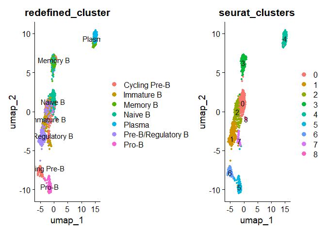

## Monocle3 requires cell_data_set object

### Convert Seurat Object to cell_data_set object for Monocle3

``` r
cds <- as.cell_data_set(b.seu)
```

    ## Warning: Monocle 3 trajectories require cluster partitions, which Seurat does
    ## not calculate. Please run 'cluster_cells' on your cell_data_set object

``` r
cds

# to get cell metadata
colData(cds)
# to gene metdata
fData(cds)
rownames(fData(cds))[1:10]

# since it misses the gene_short_name column, let's add it
fData(cds)$gene_short_name <- rownames(fData(cds))

# to get counts
counts(cds)
```

    ##   [[ suppressing 32 column names 'immB_bBM1_L10_bar67', 'immB_bBM1_L10_bar68', 'immB_bBM1_L10_bar69' ... ]]
    ##   [[ suppressing 32 column names 'immB_bBM1_L10_bar67', 'immB_bBM1_L10_bar68', 'immB_bBM1_L10_bar69' ... ]]
    ##   [[ suppressing 32 column names 'immB_bBM1_L10_bar67', 'immB_bBM1_L10_bar68', 'immB_bBM1_L10_bar69' ... ]]

## Cluster cells (using clustering info from seurat’s UMAP)

``` r
# assign paritions
reacreate.partition <- c(rep(1,length(cds@colData@rownames)))
names(reacreate.partition) <- cds@colData@rownames
reacreate.partition <- as.factor(reacreate.partition)


cds@clusters$UMAP$partitions <- reacreate.partition

# Assign the cluster info 

list_cluster <- b.seu@active.ident
cds@clusters$UMAP$clusters <- list_cluster


# Assign UMAP coordinate - cell embeddings

cds@int_colData@listData$reducedDims$UMAP <- b.seu@reductions$umap@cell.embeddings


# plot

cluster.before.trajectory <- plot_cells(cds,
           color_cells_by = 'cluster',
           label_groups_by_cluster = FALSE,
           group_label_size = 5) +
  theme(legend.position = "right")
```

    ## No trajectory to plot. Has learn_graph() been called yet?

``` r
cluster.names <- plot_cells(cds,
           color_cells_by = "redefined_cluster",
           label_groups_by_cluster = FALSE,
           group_label_size = 5) +
  scale_color_manual(values = c('red', 'blue', 'green', 'maroon', 'yellow', 'grey', 'cyan')) +
  theme(legend.position = "right")
```

    ## No trajectory to plot. Has learn_graph() been called yet?

``` r
cluster.before.trajectory | cluster.names
```

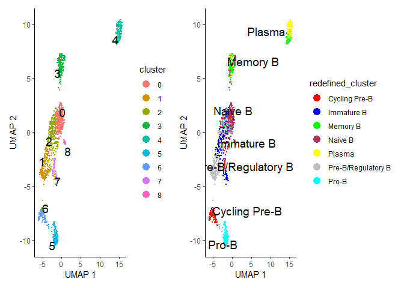

## Learn trajectory graph

``` r
cds <- learn_graph(cds, use_partition = FALSE)
```

    ##   |                                                                              |                                                                      |   0%  |                                                                              |======================================================================| 100%

``` r
plot_cells(cds,
           color_cells_by = 'redefined_cluster',
           label_groups_by_cluster = FALSE,
           label_branch_points = FALSE,
           label_roots = FALSE,
           label_leaves = FALSE,
           group_label_size = 5)
```

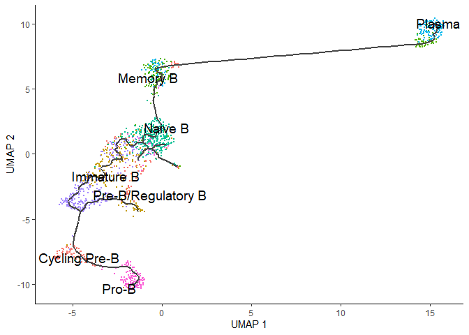

## Order the cells in pseudotime

``` r
cds <- order_cells(cds, reduction_method = 'UMAP', root_cells = colnames(cds[,clusters(cds) == 5]))

plot_cells(cds,
           color_cells_by = 'pseudotime',
           label_groups_by_cluster = FALSE,
           label_branch_points = FALSE,
           label_roots = FALSE,
           label_leaves = FALSE)
```

    ## Cells aren't colored in a way that allows them to be grouped.

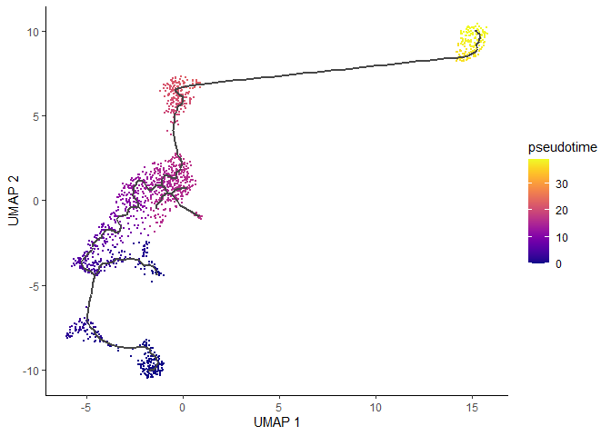

``` r
# cells ordered by monocle3 pseudotime

pseudotime(cds)
```

``` r
cds$monocle3_pseudotime <- pseudotime(cds)
data.pseudo <- as.data.frame(colData(cds))

ggplot(data.pseudo, aes(monocle3_pseudotime, reorder(redefined_cluster, monocle3_pseudotime, median), fill = redefined_cluster)) +
  geom_boxplot()
```

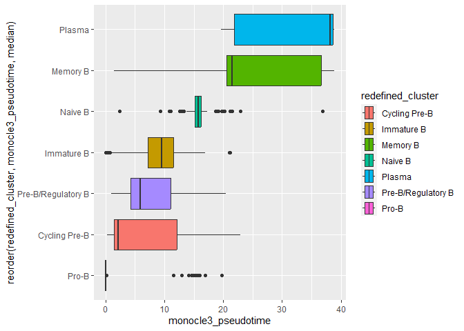

## Finding genes that change as a function of pseudotime

``` r
deg_bcells <- graph_test(cds, neighbor_graph = 'principal_graph', cores = 4)
```

    ## Warning in pbmcapply::pbmclapply(row.names(exprs_mat), FUN = function(x, : mc.cores > 1 is not supported on Windows due to limitation of mc*apply() functions.
    ##   mc.core is set to 1.

``` r
deg_bcells %>% 
  arrange(q_value) %>% 
  filter(status == 'OK') %>% 
  head()
```

    ##        status p_value morans_test_statistic  morans_I gene_short_name q_value
    ## STMN1      OK       0              70.98655 0.6862671           STMN1       0
    ## CD52       OK       0              61.09793 0.5926250            CD52       0
    ## HMGN2      OK       0              55.32323 0.5335909           HMGN2       0
    ## LAPTM5     OK       0              44.13321 0.4275057          LAPTM5       0
    ## CLSPN      OK       0              48.29806 0.4597468           CLSPN       0
    ## CSF3R      OK       0              37.72064 0.3034730           CSF3R       0

``` r
FeaturePlot(b.seu, features = c( 'CENPF', 'STMN1', 'CD52', 'FKBP11'))
```

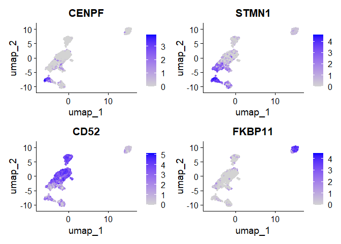

``` r
# visualizing pseudotime in seurat

b.seu$pseudotime <- pseudotime(cds)
Idents(b.seu) <- b.seu$redefined_cluster
FeaturePlot(b.seu, features = "pseudotime", label = T)
```

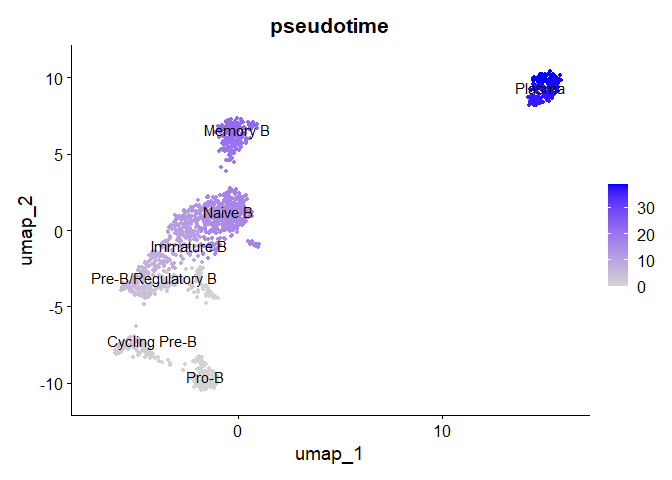
